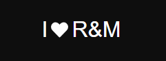
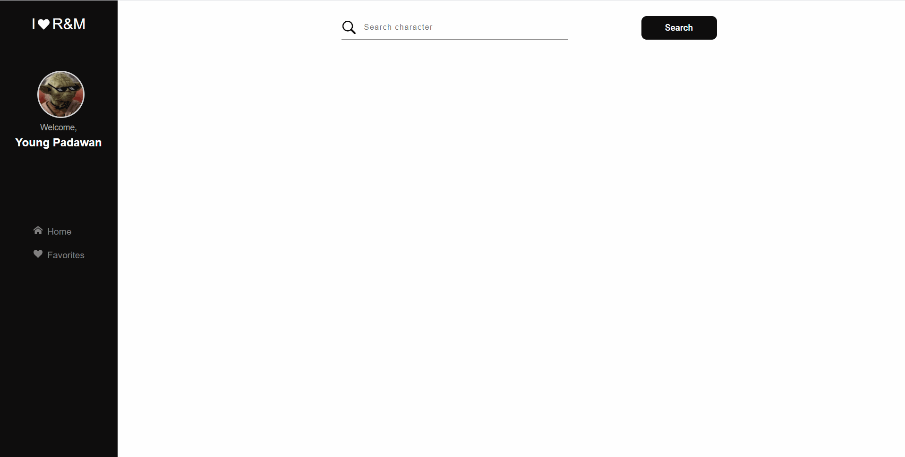

<p align="center">
  
</p>

<p align="center">
  
  
  

     
</p>


## 🔖 Layout

<h1 align="center">
    
</h1>

<br>

## 🧪 Tecnologias

Esse projeto foi desenvolvido com as seguintes tecnologias:

- [React](https://reactjs.org)
- [TypeScript](https://www.typescriptlang.org/)
- [Styled-Components](https://styled-components.com/)

## 🚀 Como executar

Clone o projeto e acesse a pasta do mesmo.

```bash
$ git clone https://github.com/PedroHConrado/rick-morty
$ cd rick-morty
```

Para iniciá-lo, siga os passos abaixo:
```bash
# Instalar as dependências
$ yarn

# Iniciar o projeto
$ yarn start
```
O app estará disponível no seu browser pelo endereço http://localhost:3000.


## 💻 Projeto

I Love R&M e uma aplicaçao para consulta, visualização e cadastro de personagens favoritos do seriado Ricky & Morty.


## 📝 License

Esse projeto está sob a licença MIT. Veja o arquivo [LICENSE](https://github.com/PedroHConrado/rick-morty/blob/main/LICENSE) para mais detalhes.

---

Feito com 💜 by Rocketseat 👋🏻 [Participe da nossa comunidade](https://discord.gg/gKUVrzrPrU)
